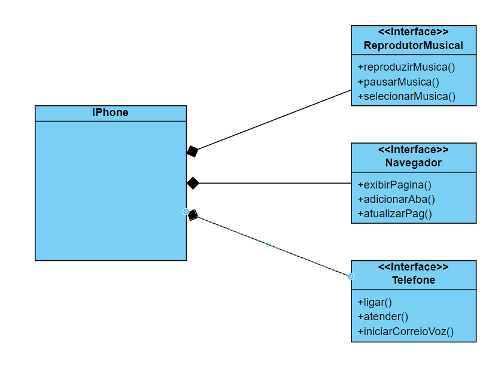

# Desafio de Projeto DIO: Modelagem de um iPhone com UML e Implementação em Java

Este repositório foi criado para cumprir um desafio de projeto da DIO (Digital Innovation One), uma empresa de cursos online. O objetivo do projeto é modelar um iPhone com três aplicações utilizando o Visual Paradigm Online para criar um diagrama de classes e, em seguida, desenvolver um código Java baseado nesse diagrama.

## Descrição do Projeto

O projeto consiste na modelagem de um iPhone que possui três aplicações:

1. **Reprodutor Musical**: Aplicação para tocar músicas.
2. **Telefone**: Aplicação para realizar chamadas.
3. **Navegador**: Aplicação para navegar na internet.

Para permitir o uso de diferentes implementações para cada aplicação, foi utilizada uma composição por interfaces. Este projeto é puramente acadêmico e não reproduz as funções reais das aplicações, apenas as simula.

### Diagrama de Classes

O diagrama de classes foi criado utilizando o Visual Paradigm Online e está disponível no arquivo `ClassDiagramIPhone.vpd`.



## Estrutura do Projeto

A estrutura do projeto é a seguinte:

```
├── ClassDiagramIPhone.vpd
├── Readme.md
├── imageDiagrama.png
├── src
│   ├── Principal.java
│   ├── implementacoes
│   │   ├── IPhone.java
│   │   ├── navegador
│   │   │   ├── Chrome.java
│   │   │   └── Safari.java
│   │   ├── reprodutorMusical
│   │   │   ├── ITune.java
│   │   │   └── Spotify.java
│   │   └── telefone
│   │       └── TelefonePadrao.java
│   └── interfaces
│       ├── Navegador.java
│       ├── ReprodutorMusical.java
│       └── Telefone.java
```

- **ClassDiagramIPhone.vpd**: Arquivo do diagrama de classes criado no Visual Paradigm Online.
- **Readme.md**: Documento de descrição do projeto.
- **imageDiagrama.png**: Imagem do diagrama de classes.
- **src**: Diretório contendo o código-fonte do projeto.
    - **Principal.java**: Classe principal para execução do sistema.
    - **implementacoes**: Diretório contendo as implementações das interfaces.
        - **IPhone.java**: Classe que representa o iPhone, agregando as diversas aplicações.
        - **navegador**: Diretório contendo implementações da interface Navegador.
            - **Chrome.java**: Implementação do navegador Chrome.
            - **Safari.java**: Implementação do navegador Safari.
        - **reprodutorMusical**: Diretório contendo implementações da interface ReprodutorMusical.
            - **ITune.java**: Implementação do reprodutor musical iTunes.
            - **Spotify.java**: Implementação do reprodutor musical Spotify.
        - **telefone**: Diretório contendo a implementação da interface Telefone.
            - **TelefonePadrao.java**: Implementação padrão do telefone.
    - **interfaces**: Diretório contendo as interfaces que definem os contratos para as aplicações.
        - **Navegador.java**: Interface para navegadores.
        - **ReprodutorMusical.java**: Interface para reprodutores musicais.
        - **Telefone.java**: Interface para telefones.


## Contribuição

Contribuições são bem-vindas! Se você deseja contribuir com este projeto, por favor, abra uma issue ou envie um pull request.


---

Desenvolvido como parte de um desafio de projeto da DIO.